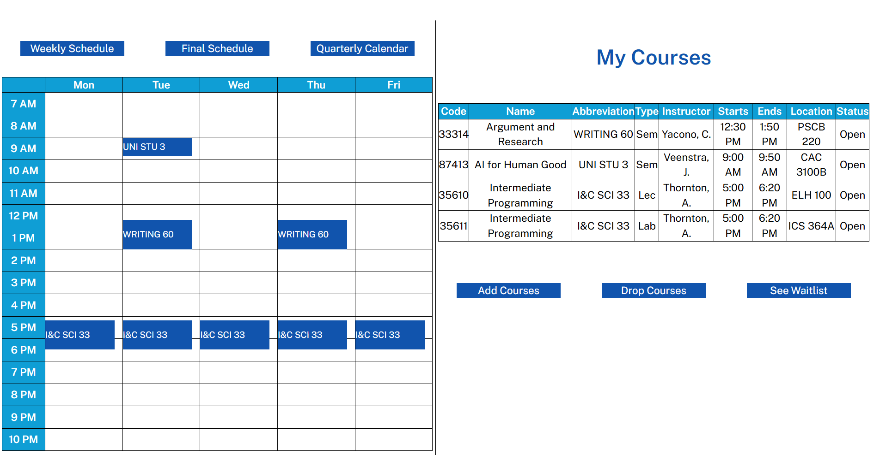
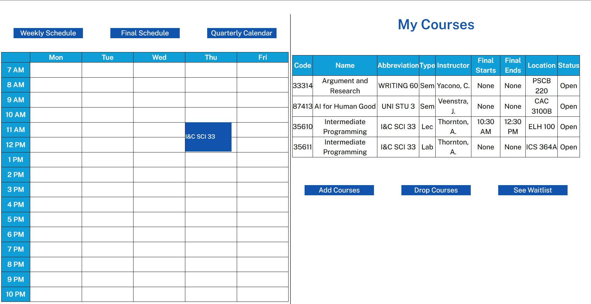
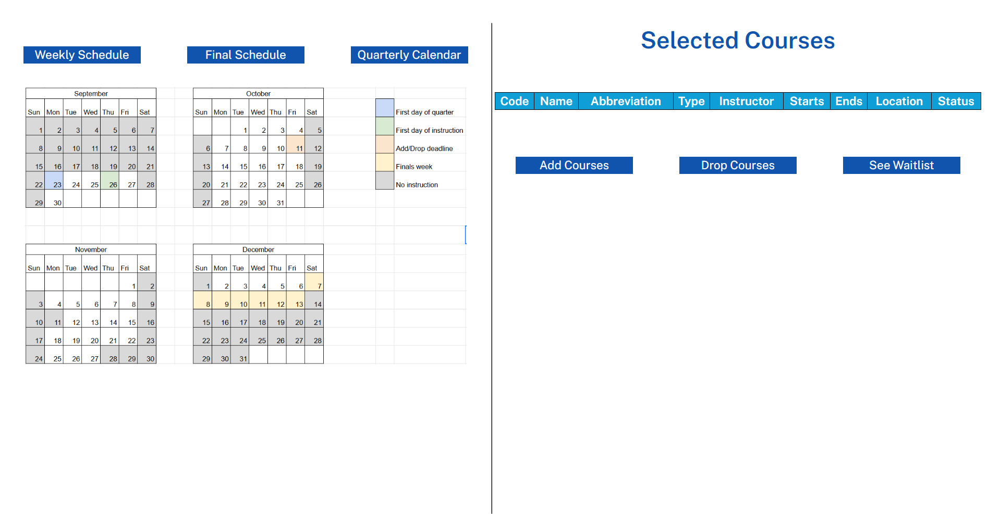
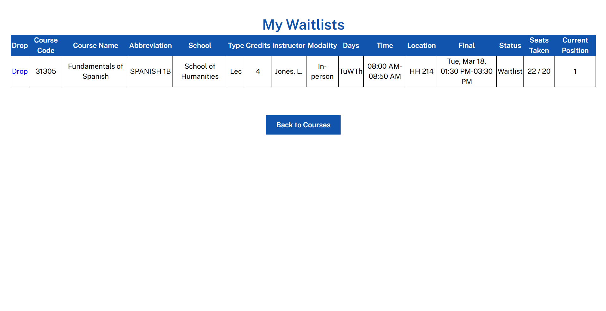
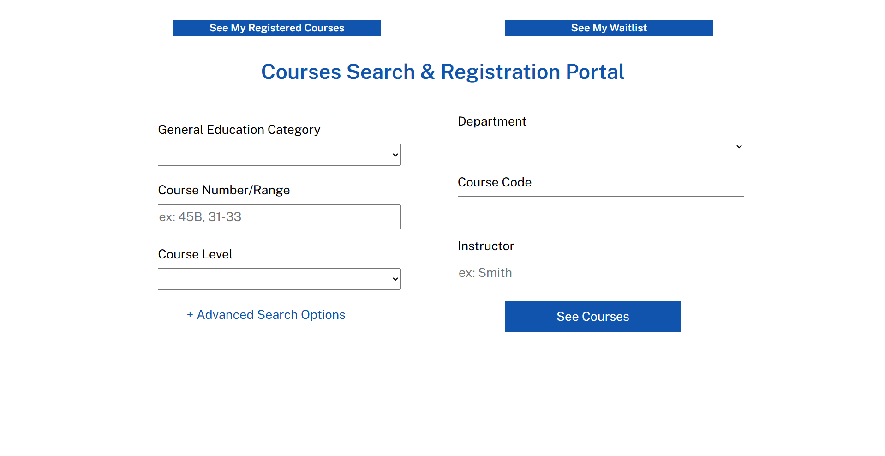
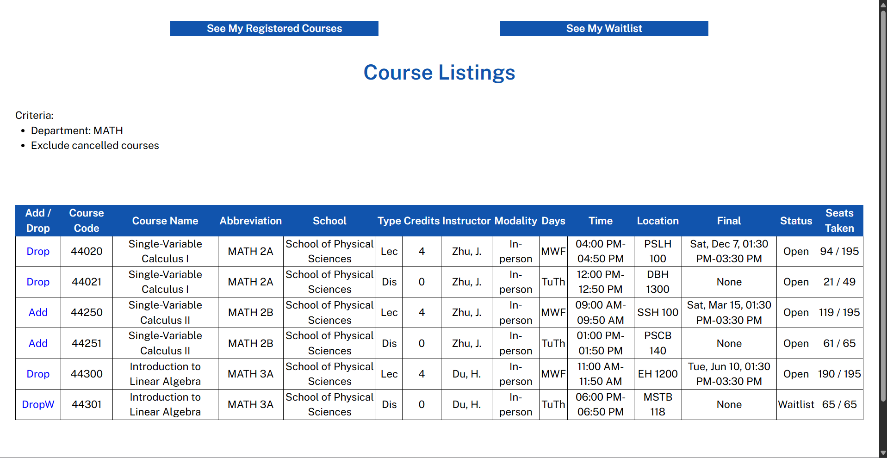

# Course Registration
This project is a demo course registration application, designed with UC Irvine–style course registration constraints in mind. The application is a simulation of real-world course registration in universities, where students can view and organize their schedules in an efficient, user-friendly, and organized manner.

The objective of this project is to illustrate important constraints of academic registration systems like student registration limits, waiting lists, or scheduling, as well as basic web application concepts like user interactions, data validation, and state management on the server.

This repository acts as a functional prototype; it is not a production-ready system.

## Tech Stack
Frontend: HTML/CSS
Backend: Python (Flask)
Database: MySQL

## Key Features
Through this platform, users can:
* Browse available courses and view detailed course information
* Filter courses based on specified criteria (e.g., department or availability)
* Register for and drop classes in real time
* Join waitlists for courses that have reached capacity

## Backend Logic & Constraints
The backend enforces core registration rules, including:
- Enrollment caps per course
- Automatic waitlisting when courses reach capacity
- Prevention of duplicate enrollments
- Server-side validation of schedule updates

These constraints are handled at the application and database level to ensure
consistent system state regardless of frontend behavior.

## Screenshots
 
 
 

## Running Locally
To run this project locally:
1. Ensure Python (3.9+) and SQLite are installed on your machine.
2. Clone the repository and navigate to the project directory.
3. Create and activate a virtual environment, then install the required dependencies.
4. Create a .env file in the root directory to store environment variables such as the Flask configuration, secret key, and database connection details.
5. An .env.example file is provided to show the required environment variables and expected format.
6. Start the Flask development server.
7. Open the application in your browser at http://127.0.0.1:5000.
8. You should now be able to use the dashboard locally to view, add, drop, and waitlist courses.

### Database Setup
- The application uses a relational database with tables representing courses, departments, instructors, etc.
- Create a SQLite database for the application.
- Database tables are created manually during development.
- A formal schema or migration setup is planned as a future improvement.

## Scope
This project focuses on backend constraint enforcement and data modeling. Authentication, deployment, and UI optimization were intentionally out of scope.

## Future Improvements
* Improve overall UI/UX and visual design
* Prevent students from registering for multiple courses in the same time slot
* Add authentication and student-specific dashboards
